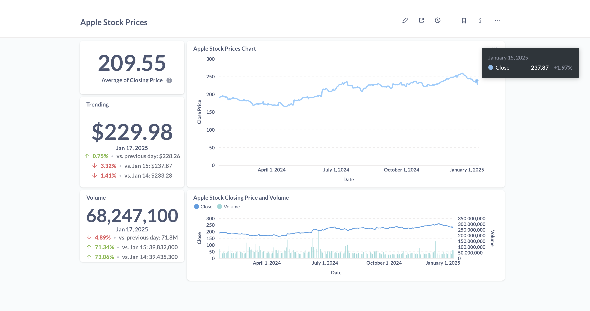
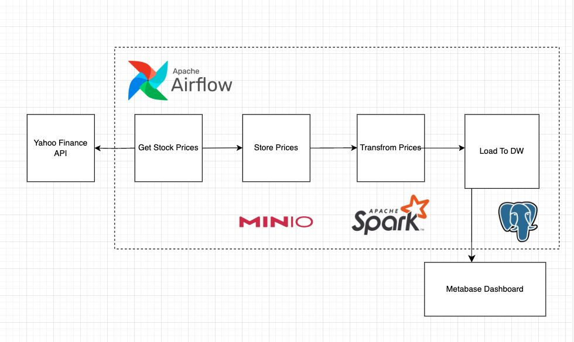

# Apple Stock Market Data Pipeline

## Overview

An ETL data pipeline orchestrated with Airflow that pulls Apple stock market data from the Yahoo Finance API. The raw data is stored in MinIO (a self-hosted version of S3), formatted and transformed using PySpark, and finally loaded into a PostgreSQL data warehouse for reporting purposes.



## The Pipeline Flow



## How to run

### Prerequisite

Make sure that you installed the following items on your machine.

- [Astro CLI](https://pages.github.com/)
- Docker
  Astronomer is a managed platform and service that simplifies the deployment, scaling, and monitoring of Apache Airflow workflows.

### Steps

1. **Start Airflowby running the following command**
   ```bash
   astro dev start
   ```

This command will spin up 4 Docker containers on your machine, each for a different Airflow component:

    - Postgres: Airflow's Metadata Database
    - Webserver: The Airflow component responsible for rendering the Airflow UI
    - Scheduler: The Airflow component responsible for monitoring and triggering tasks
    - Triggerer: The Airflow component responsible for triggering deferred tasks

- Access the Airflow UI for your local Airflow project. To do so, go to http://localhost:8080/ and log in with 'admin' for both your Username and Password. Astro automatically exposed Webserver at port 8080 and Postgres at 5432, If all of them are already allocated, change to alternative port in `docker-compose.override.yml`.

### Adding Connections in the UI

After logging into the UI, add connections for the following three components: **Postgres**, **MinIO**, and the **Yahoo Finance API**. Follow these steps:

2. **Navigate to Connections**

   - Go to `Admin > Connections` and select the **Add a new connection** button.

3. **Set Up Connections**

   #### 1. Yahoo Finance API

   - **Connection ID**: `stock-api`
   - **Connection Type**: `HTTP`
   - **Host**: `https://query1.finance.yahoo.com`
   - **Extra**:
     ```json
     {
       "endpoint": "/v8/finance/chart/",
       "headers": {
         "content-type": "application/json",
         "user-agent": "Mozilla/5.0 (X11; Linux x86_64) AppleWebKit/537.36 (KHTML, like Gecko) Chrome/108.0.0.0 Safari/537.36"
       }
     }
     ```

   #### 2. Postgres

   - **Connection ID**: `postgres`
   - **Connection Type**: `Postgres`
   - **Host**: `postgres`
   - **Login**: `postgres` (default value)
   - **Password**: `postgres` (default value)
   - **Port**: `5432` (or your custom port)

   #### 3. MinIO

   - **Connection ID**: `minio`
   - **Connection Type**: `Amazon Web Services`
   - **AWS Access Key ID**: `insert your key here`
     - The value in the Docker file is `yourkey`, but feel free to modify it.
     - Ensure this value matches the one in the Docker Compose file.
   - **AWS Secret Access Key**: `insert your key here`
     - The value in the Docker file is `yourpass`, but feel free to modify it.
     - Ensure this value matches the one in the Docker Compose file.
   - **Extra**:
     ```json
     {
       "endpoint_url": "http://minio:9000"
     }
     ```

4. **Trigger the DAG on the UI**/

   You can now trigger the DAG or modify the cron under `dags/stock_market.py`

5. **See loaded date in Postgres**
   Preview apple stock price data by running

```sql
SELECT
    *
FROM
    stock_prices
ORDER BY
    date DESC
LIMIT 10
```

7. **Do Analytics with Metabase**/

   Navigate to http://localhost:3000/ and start bulding your dashboard 🚀.

Update readme from feature!
Second update!
